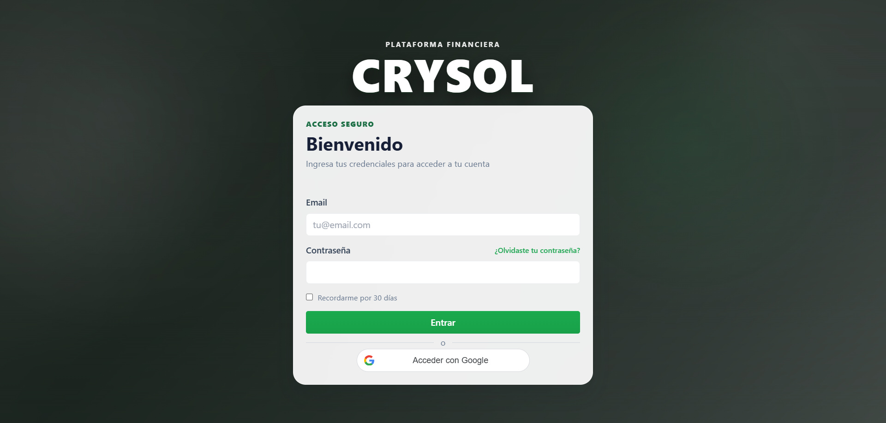
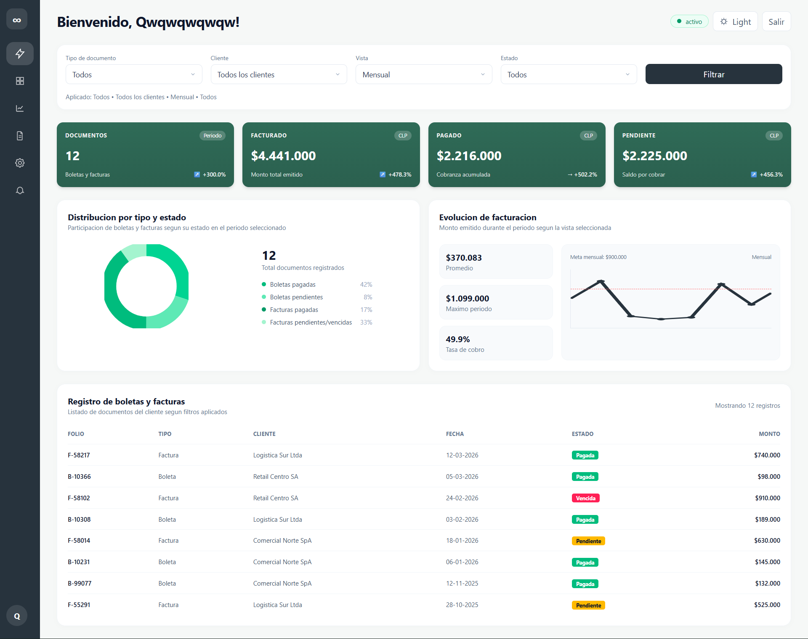
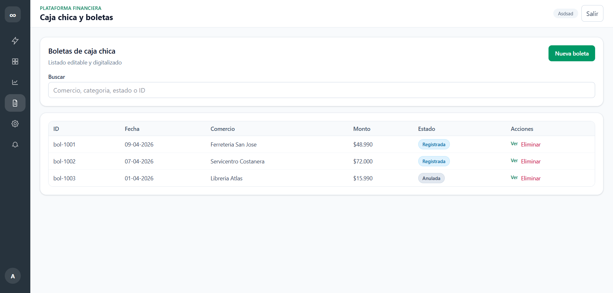
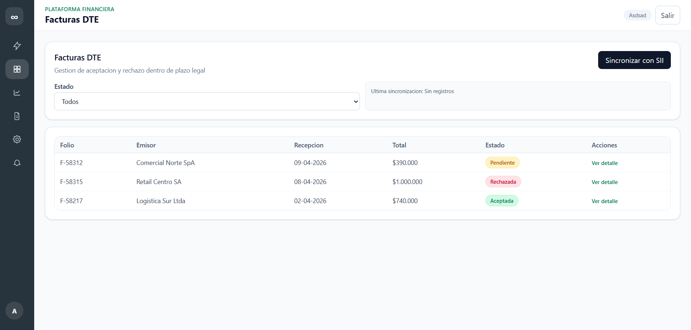
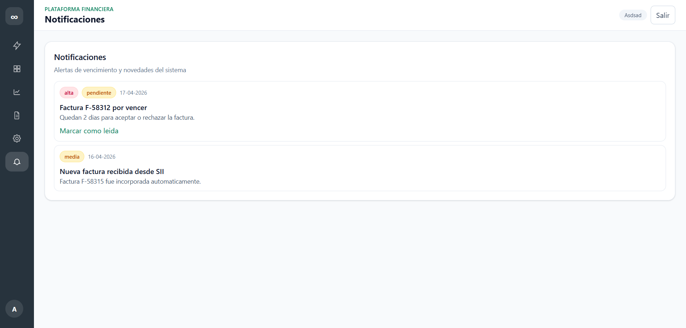

# Informe de Mockups - Semana 2

## Resumen ejecutivo

Durante la semana 2 se consolidaron los mockups de las vistas clave del MVP, con una linea visual unificada: sidebar izquierdo oscuro, cabecera superior con contexto de modulo y tarjetas de contenido con foco en lectura rapida.

El trabajo de esta semana cubre:

- Pantalla de acceso (login) con enfoque de seguridad y doble opcion de ingreso.
- Dashboard financiero con indicadores, filtros, visualizaciones y tabla de documentos.
- Modulos funcionales del negocio: caja chica (boletas), facturas DTE, reportes, configuracion de certificado y notificaciones.
- Coherencia en navegacion y estructura para escalar a implementacion mobile-first y desktop.

## Vistas y hallazgos principales

- Login: experiencia centrada en autenticacion, formularios claros y acceso con Google.
- Dashboard: vista de control general con metricas financieras y estado documental.
- Caja chica y boletas: listado con busqueda, estados y accion directa para crear boleta.
- Facturas DTE: gestion de estados (pendiente/rechazada/aceptada) y sincronizacion con SII.
- Exportacion y reportes: formulario de generacion de reportes y trazabilidad en historial.
- Configuracion: carga de certificado digital con recomendaciones de seguridad.
- Notificaciones: alertas operativas para vencimientos y eventos relevantes.

## Galeria de mockups (2 por fila)

<table>
	<tr>
		<td width="50%" valign="top">
			<h4>Login</h4>
			
			
Pantalla de autenticacion con formulario principal, recordar sesion y acceso con Google.

		</td>
		<td width="50%" valign="top">
			<h4>Dashboard financiero</h4>
			
			
Vista de resumen con filtros, KPIs, distribucion, evolucion y tabla de documentos.

		</td>
	</tr>
	<tr>
		<td width="50%" valign="top">
			<h4>Caja chica y boletas</h4>
			
			
Listado editable de boletas con buscador, estados y accion de creacion.

		</td>
		<td width="50%" valign="top">
			<h4>Facturas DTE</h4>
			
			
Gestion de facturas con filtro por estado y boton de sincronizacion con SII.

		</td>
	</tr>
	<tr>
		<td width="50%" valign="top">
			<h4>Exportacion y reportes</h4>
			
			
Generador de reportes (PDF/CSV) con rango de fechas e historial de ejecuciones.

		</td>
		<td width="50%" valign="top">
			<h4>Configuracion</h4>
			
			
Carga segura de certificado digital y bloque de recomendaciones operativas.

		</td>
	</tr>
	<tr>
		<td width="50%" valign="top">
			<h4>Notificaciones y alertas</h4>
			
			
Listado de alertas con prioridad, fecha, estado de lectura y accion de marcado.

		</td>
		<td width="50%" valign="top">
			<h4>&nbsp;</h4>
			
Espacio reservado para proximas vistas o iteraciones de Semana 3.

		</td>
	</tr>
</table>

## Conclusion de la semana

La semana 2 se implementan el lenguaje visual de la semana 1 y la cobertura de vistas principales del MVP. Los mockups muestran una base consistente para pasar a refinamiento de interacciones, estados vacios/loading y ajustes responsive detallados en la siguiente iteracion.
