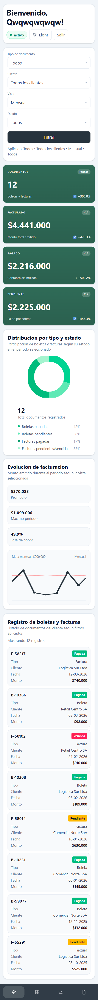
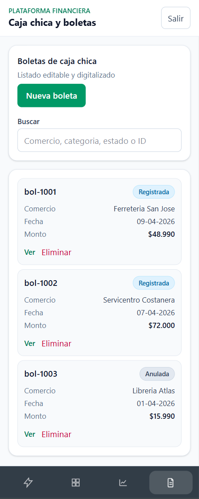
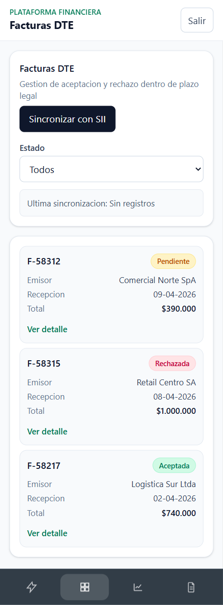
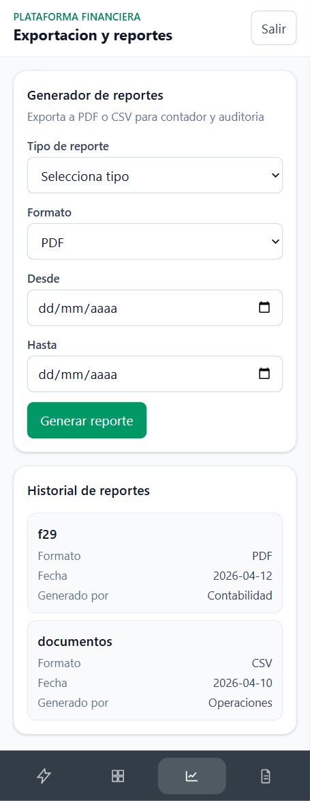

# Informe de Mockups Mobile - Semana 3

## Resumen breve

Durante la semana 3 se trabajó el ajuste visual y funcional en vista móvil de los módulos principales del sistema. Se priorizó la experiencia mobile-first, mejorando jerarquía visual, legibilidad de formularios y adaptación de tablas/listados para pantallas pequeñas.

Principales avances:

- Reorganización de componentes para apilado vertical en móvil.
- Mejora de lectura en tarjetas, filtros y tablas densas.
- Ajustes de interacción para mantener consistencia entre módulos.

## Galería de mockups mobile (4 por fila)

<table>
	<tr>
		<td width="25%" valign="top">
			<h4>Dashboard móvil</h4>
			
			
Vista principal optimizada para scroll vertical y lectura rápida de métricas.

		</td>
		<td width="25%" valign="top">
			<h4>Boletas móvil</h4>
			
			
Listado y acciones de boletas adaptadas para uso táctil y navegación simple.

		</td>
		<td width="25%" valign="top">
			<h4>Facturas móvil</h4>
			
			
Gestión de facturas con filtros compactos y estructura clara para seguimiento.

		</td>
		<td width="25%" valign="top">
			<h4>Reportes móvil</h4>
			
			
Generación y consulta de reportes con formulario simplificado en pantallas pequeñas.

		</td>
	</tr>
</table>

## Cierre de semana

La semana 3 consolida la base mobile del proyecto, dejando los módulos clave listos para iteraciones de detalle en accesibilidad, estados vacíos/loading y refinamiento de interacción en dispositivos reales.
